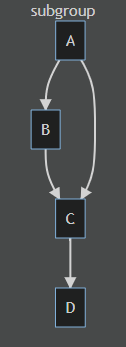
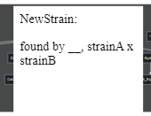

# TATGenealogy
 genealogy of TAT

## how to view
visit https://tituman.github.io/TATGenealogy/

clicking or tapping on a strain will show a popup with details.  
clicking or tapping on any strain will make the popup disappear.

## how to use / contribute

using the [mermaid.js](https://mermaid-js.github.io/) framework.

the following code in [index.html](index.html)

```HTML
<div class="mermaid">
graph TD
subgraph OG-Cube
A --> B
B --> C
A --> C
C --> D
end
</div>
```

will generate the following tree



### strain details
to add information for a specific strain, file [strainDB.js](strainDB.js) can be edited by adding a new line at the end from the template.
```javascript
...
,'NewStrain' : 'NewStrain: <p>found by __, strainA x strainB</p>'
...
};
```
make sure "NewStrain" is written exactly the same in the HTML and in the strainDB.  
that way, it will render a description as follows:


 